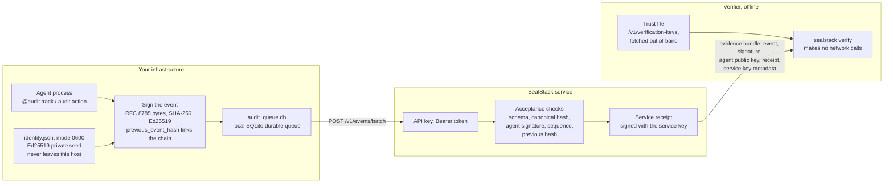

<p align="center">
  
</p>

<h1 align="center">SealStack</h1>

<p align="center"><strong>Signed, hash-chained action records for AI agents, with a server receipt for every record and a verifier that runs offline.</strong></p>

<p align="center">
  <a href="LICENSE"></a>
  <a href="pyproject.toml"></a>
</p>

[](https://github.com/unempyd/sealstack-sdk/raw/main/assets/sealstack-60s.mp4)

[Download the 60-second demonstration](https://github.com/unempyd/sealstack-sdk/raw/main/assets/sealstack-60s.mp4) (MP4, silent, 1920x1080, 2.8 MB).

Agent action → signed event → hash chain → SealStack service receipt → offline verification → optional AERF / Agent Receipts / noa export

SealStack turns what an AI agent did into evidence that someone outside your
infrastructure can check. Each action is signed on your own host, by the
agent's own key, before it runs. The actions of one agent run are hash-chained,
so the record is tamper-evident: a change, a reordering or a deletion breaks
the chain. The SealStack service counter-signs every record it accepts and
hands back a cryptographic agent receipt. A receipt verifies offline, from the
bundle and a trust file alone, with no network call and no access to your
systems. That is an AI agent audit trail you can hand to an auditor, a customer
or a reviewer, and it is the kind of evidence you can keep for EU AI Act
record-keeping obligations. Receipts also export to AERF, to the Agent Receipt
Protocol and to the noa SCITT agent receipt profile.

Read this caveat before anything else: agent key rotation is disabled in V1,
`sealstack rotate-key` exits 2 with a message pointing at v0.2, and there is no
dashboard rotation action.

## Install

```sh
pip install sealstack
```

The package is published to PyPI with the v0.1.3 release, and that line becomes
valid at release; until then, run `pip install .` from a checkout.

Before 0.1.3 the package imported as `product`; that name still works as an
alias, so `from product import AuditClient` and the `product` command keep
working. New code should use `sealstack`.

## Quickstart

Set `AUDIT_API_KEY` to an API key and `SEALSTACK_API_URL` to the origin you are
uploading to. That is either the hosted service or the reference server in this
repository, which you can run on your own machine. For a first run, use the
reference server (see [Reference server](#reference-server)).

```sh
export SEALSTACK_API_URL=http://127.0.0.1:8000
export AUDIT_API_KEY=pick-a-long-random-string
```

```python
import os
from sealstack.client import AuditClient

audit = AuditClient(api_key=os.environ["AUDIT_API_KEY"], agent_name="billing-agent")


@audit.track(action="invoice.create", resource_type="invoice", resource_id="INV-2026-0042")
def create_invoice(customer_id, amount_cents):
    return {"invoice_id": "INV-2026-0042", "total": amount_cents}


create_invoice("cust-118", 24900)
audit.close()
```

[Quickstart detail](#quickstart-detail) explains what those lines do and how
the client is configured.

## What problem SealStack solves

An application log is a record your own system writes and your own system can
change. AI agent logging of that kind answers what you can still read in your
own database; nothing inside the file shows whether a row was edited,
reordered or removed afterwards, and a reader outside the system that produced
it has no way to tell.

SealStack records the same actions as a cryptographic audit trail for AI
agents, which differs in three ways:

- **Signed before the fact.** The agent signs the record with an Ed25519 key
  held on its own host, before the action runs. Forging a record for a
  registered agent means holding that private key.
- **Chained.** Records of one runtime carry the previous record's hash, so
  removing, reordering or editing one of them is detectable from the records
  themselves. That is what makes them tamper-evident agent logs rather than
  rows in a table.
- **Counter-signed.** The service signs what it accepted, with the acceptance
  context it resolved at that moment. This is a counter-signature by the
  receiving service, not an attestation by an independent third party.

The result is AI agent accountability and AI agent compliance evidence that
survives leaving the database it was stored in: the person checking it needs
the exported bundle and a list of service verification keys, and nothing else.

## See it working

The 60-second film above is the fastest version:
[download it](https://github.com/unempyd/sealstack-sdk/raw/main/assets/sealstack-60s.mp4). Then three real captures.


The activity page of the dashboard. Ten rows for one agent named
`billing-agent`, under the columns TIME, AGENT, ACTION, RESOURCE, STATUS,
SPONSOR and VERIFICATION. The action names are `invoice.create`,
`customer.email.send`, `customer.update` and `ledger.reconcile`. The STATUS
column carries the event type, so the ten rows are five actions, each one an
`action.started` row plus its outcome row: four `action.completed` and one
`action.failed`. Every row names the same sponsor, resolved by the service at
ingestion, and every row reads VALID in the VERIFICATION column.


One event page. The heading reads VERIFICATION STATUS: VALID, directly above
the sentence "This status describes cryptographic signature and hash validity
only. It is not evidence that the external real-world action occurred, nor
that logged inputs and outputs were truthful." Below that: the action
`invoice.create`, the event type `action.completed`, the agent
`billing-agent`, the agent key id marked `(active)`, the agent key fingerprint
as a `sha256:` hash, the runtime id, sequence 2, the occurred-at and
received-at times, the resource `invoice / INV-2026-0042`, the sponsor, the
capability grant id with the three capabilities it lists, the error type
`none`, the event hash as a `sha256:` hash, and the agent signature.

Offline verification of an exported receipt, captured from a terminal after
the server had been stopped:

```text
$ sealstack verify receipt.json --trusted-service-keys keys.json
Event hash:              VALID
Agent signature:         VALID
Agent key fingerprint:   VALID
Service receipt:         VALID
Runtime chain link: VALID
$ echo $?
0
```

## How it works



Two properties of that picture are worth stating plainly:

- **The agent private key never crosses the boundary.** It is generated on the
  customer host, kept in `identity.json` at mode 0600 in the state directory,
  and only its public half is registered. The service never receives it, and
  `sealstack export` reads it on the customer machine too.
- **The service cannot forge an agent signature.** It holds only the agent's
  public key, so it can check a signature and it can counter-sign what it
  accepted, but it cannot produce a record that verifies as the agent's.
  Symmetrically, the agent cannot forge a service receipt: the verifier
  resolves the service key only in the trust file it was given, never from the
  bundle it is checking.

## What gets verified

V1 proves three things about every record the service accepts: that a
registered agent key signed it before the action ran, that it sits where it
claims inside its runtime chain, and that the service signed what it accepted.

The exact verification procedure, step by step with its statuses and exit
codes, is Section 10.3 of [SPEC-RECEIPT.md](SPEC-RECEIPT.md).

What it does not prove is carried byte for byte in every exported receipt. The
verifier rejects a bundle whose copy of it differs.

```text
This receipt verifies cryptographic relationships between the
included data, registered keys and service receipt.

It does not independently prove:

• that an external real-world action occurred;
• that logged inputs or outputs were truthful;
• that the agent host was uncompromised;
• that the private key was never stolen;
• that uninstrumented actions did not occur;
• the legal identity of a human sponsor;
• that the sponsor personally authorised this individual action;
• legal liability;
• regulatory compliance.
```

## Interoperability

`sealstack export` rewrites one evidence bundle into an external receipt format,
signing the result with the agent key on your machine. The server never sees
that key and takes no part in the export.

```sh
sealstack export --format aerf receipt.json --state-dir ~/.sealstack/billing-agent
sealstack export --format agent-receipts receipt.json --state-dir ~/.sealstack/billing-agent
sealstack export --format scitt receipt.json --state-dir ~/.sealstack/billing-agent
```

| Format | Target version | Modes | Signing location | External verification | Known limitation |
| --- | --- | --- | --- | --- | --- |
| AERF, Agent Evidence Receipt Format | v0.1.0-draft.1 (tag `v0.1.0-draft.1` of github.com/aerf-spec/aerf) | `subset` (default) and `full` (`--mapping`) | Customer side: the SDK reads the agent key from the local identity directory or a seed file | The AERF Go reference verifier built from the v0.1.0-draft.1 tag and from the repository main branch (v0.2.0-draft.1); full-mode artifact exits 0, a tampered copy exits 1 | An artifact whose `evidence` contains non-ASCII text verifies under the v0.1.0-draft.1 verifier and fails under the main-branch verifier; the golden fixture is ASCII and passes both |
| Agent Receipt Protocol | 0.5.0 (agentreceipts.ai, `@context` `https://agentreceipts.ai/context/v2`) | `subset` (default) and `full` (`--mapping`) | Customer side, same key and same lock | The `obsigna` Python package (its build on this machine reports protocol 0.6.0 and context v3; its `verify_raw` and `verify_receipt` accepted the 0.5.0 artifact and rejected a tampered copy) | The schema declares no extension point for foreign evidence, so the native bundle travels beside the artifact as `<artifact>.sealstack.json` |
| noa profile, draft-noa-scitt-ai-agent-receipt-01 | `noa.receipt/0.1`, bare receipt form | `subset` (default) and `full` (`--mapping`) | Customer side, same key and same lock | Internal specification-derived test only. No external or reference verifier was run | The receipt is a closed object, so the native bundle travels beside it as `<artifact>.sealstack.json`; no COSE_Sign1 envelope, SCITT Signed Statement or transparency registration is produced |

The default `subset` mode omits fields whose semantics SealStack does not
record, writes no placeholder in their place, and labels the artifact
non-conformant with the exact list of missing fields. Full mode takes an
operator mapping file and refuses to write anything when an action is missing
from it.

Four limitations apply to all three exports: subset artifacts are not
conformant to their target specification; full-mode conformance depends on the
operator's mapping being truthful, because SealStack does not evaluate policy,
classify actions or assess risk; the AERF and Agent Receipts production
profiles expect RFC 3161 trusted timestamps and none is produced; and chain
fields are set only when predecessor evidence is in the bundle. SealStack does
not consume any of these formats, and `sealstack verify` reads only the native
bundle.

[COMPATIBILITY.md](COMPATIBILITY.md) states the exact version of each target
format, every field mapping, what was verified against which external verifier,
and the limitations of the exports.

## Offline verification

Fetch `/v1/verification-keys` from the service origin over authenticated HTTPS,
save it as a local trust file, and pass it explicitly. The verifier makes no
network calls and never reads trust from the bundle it is checking.

```sh
sealstack verify receipt.json --trusted-service-keys service-keys.json
```

Exit codes:

| Code | Meaning |
| --- | --- |
| `0` | Cryptographically valid for the supplied evidence |
| `1` | Invalid |
| `2` | Incomplete or unverifiable |

The `Runtime chain link` line reports the chain only for a predecessor bundle
you supplied. Without one, the verifier reports the runtime chain as NOT
VERIFIED instead of inferring history it has not seen.

Change one field inside the bundle and the same command prints INVALID and
exits 1. This capture flips a single character of the service receipt
signature:

```text
flipped service_receipt.signature[0]: 's' -> 't'
```

```text
$ sealstack verify receipt.json --trusted-service-keys keys.json
Service receipt:         INVALID — bundle: service receipt signature does not verify
Evidence bundle:         INVALID — bundle: service receipt signature does not verify
$ echo $?
1
```

## Quickstart detail

The full form of the quickstart, with a context manager beside the decorator:

```python
import os
from sealstack.client import AuditClient

audit = AuditClient(api_key=os.environ["AUDIT_API_KEY"], agent_name="billing-agent")


@audit.track(action="invoice.create", resource_type="invoice", resource_id="INV-2026-0042")
def create_invoice(customer_id, amount_cents):
    return {"invoice_id": "INV-2026-0042", "total": amount_cents}


create_invoice("cust-118", 24900)

with audit.action("ledger.reconcile", resource_type="ledger", resource_id="2026-09"):
    pass  # your own reconciliation work goes here

audit.close()
```

The first `AuditClient` generates an Ed25519 key pair on your host, registers the public half and
keeps the private seed in the state directory. `@audit.track` writes an `action.started` record
before your function runs and an `action.completed` or `action.failed` record after it returns;
it decorates async functions too. `audit.action(...)` does the same for a block that is not a
single call. The business function runs exactly once and always returns its own result or raises
its own exception.

### SDK configuration

`AuditClient` resolves two settings with the same precedence: constructor
argument, then environment variable, then default.

- API base URL: `base_url` argument, then `SEALSTACK_API_URL`, then
  `https://api.sealstack.com`.
- State directory: `state_dir` argument, then `SEALSTACK_STATE_DIR`, then
  `~/.sealstack/<agent_name>`.

## Reference server

`reference-server/` implements the four SDK-facing endpoints so you can run the
whole loop on your own machine: register an agent, upload signed events, get
counter-signed receipts and verify them offline.

The reference server is not part of the PyPI package: `pip install sealstack`
does not install it. Clone this repository and run it from the checkout.

```sh
git clone https://github.com/unempyd/sealstack-sdk
cd sealstack-sdk
pip install -e ".[reference-server]"
SEALSTACK_REF_API_KEY=pick-a-long-random-string \
    uvicorn server:app --app-dir reference-server --host 127.0.0.1 --port 8000
```

It is not the hosted service and it is not a production server. One tenant, one
bearer key, SQLite storage, no dashboard, no user accounts, no sponsor or
capability-grant context, no key rotation, and a signing key that sits on the
same machine as the agent. [reference-server/README.md](reference-server/README.md)
states exactly what it checks and what it leaves out.

## Security and limitations

### Key rotation

Agent key rotation is disabled in V1: `sealstack rotate-key` always exits 2 and
prints a message pointing to v0.2. There is no dashboard rotation action.
The server endpoint `POST /v1/agents/{agent_id}/keys` is retained as v0.2
groundwork and remains covered by the acceptance tests.

### Documents

| File | Contents |
| --- | --- |
| [SPEC-RECEIPT.md](SPEC-RECEIPT.md) | The receipt format: records, canonical encoding, hash chain, receipt, evidence bundle and the offline verification procedure. |
| [COMPATIBILITY.md](COMPATIBILITY.md) | What SealStack emits, which external formats it can produce, how each export is built and what was verified. |
| [SECURITY.md](SECURITY.md) | How to report a vulnerability, and what V1 does and does not defend against. |
| [DEVIATIONS.md](DEVIATIONS.md) | Where this SDK differs from the specification. |
| [LICENSE](LICENSE) | Apache-2.0. |

This repository is an export of the SDK from the SealStack source repository; it is regenerated by that repository's scripts/export-sdk.sh, so open pull requests here against the SDK files with that in mind.

## Layout

| Path | Contents |
| --- | --- |
| `sdk/sealstack/` | The SDK, the CLI and the offline verifier. |
| `sdk/product/` | The pre-0.1.3 import name, kept as an alias of `sdk/sealstack/`. |
| `sdk/tests/` | Platform and export-format tests, with their fixtures. |
| `reference-server/` | The minimal server described above, and its tests. |
| `assets/` | The mark, the 60-second film, its poster and the dashboard captures used in this README. |

```sh
pip install -e ".[dev]"
pytest -q
ruff check .
mypy --strict --explicit-package-bases sdk/sealstack reference-server
```
