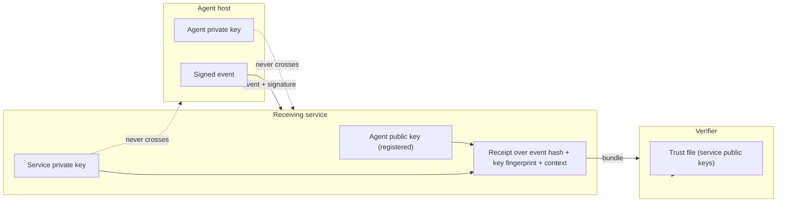
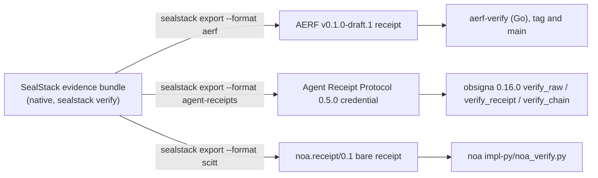

<p align="center">
  
</p>

<h1 align="center">SealStack</h1>

<p align="center"><strong>Signed, hash-chained action records for AI agents, counter-signed by the receiving service and verifiable offline. Not a log you have to trust: evidence you can check.</strong></p>

<p align="center">
  <a href="https://github.com/unempyd/sealstack-sdk/actions/workflows/test.yml"></a>
  <a href="https://pypi.org/project/sealstack/"></a>
  <a href="LICENSE"></a>
  <a href="pyproject.toml"></a>
</p>

SealStack is a Python SDK and a published receipt format. Every action an AI
agent takes is written as a record that the agent signs with an Ed25519 key on
its own host before the action runs. The records of one process run are
hash-chained, so editing, reordering or deleting one is detectable from the
records alone. The service that receives a record counter-signs it and returns
a receipt. The record, the signatures and the receipt travel together as an
evidence bundle that anyone can verify offline with a trust file, and that can
be exported to three external receipt formats. The format is published so
that others can implement it; it is not a standard.

What it does not prove is stated inside every bundle, byte for byte: that the
action really happened in the world, that inputs or outputs were truthful, that
the host or key was uncompromised, or that anything was legally authorised.
See [What is verified, and what is not](#what-is-verified-and-what-is-not).

## Verify a receipt in 60 seconds


No server, no account. The receipt below is the format's published test vector
([SPEC-RECEIPT.md, Section 12](SPEC-RECEIPT.md#12-test-vector)); the trust
file holds the public key of the service that counter-signed it.

```sh
pip install sealstack
curl -sO https://raw.githubusercontent.com/unempyd/sealstack-sdk/main/sdk/tests/fixtures/golden-evidence-bundle.json
curl -sO https://raw.githubusercontent.com/unempyd/sealstack-sdk/main/sdk/tests/fixtures/service-keys.json
sealstack verify golden-evidence-bundle.json --trusted-service-keys service-keys.json
```

```text
Event hash:              VALID
Agent signature:         VALID
Agent key fingerprint:   VALID
Service receipt:         VALID
Runtime chain:           NOT VERIFIED — predecessor absent
```

Exit code 0. Now change one character of the service signature and run the
same command:

```sh
sed -i.orig 's/"signature": "vthO/"signature": "wthO/' golden-evidence-bundle.json
sealstack verify golden-evidence-bundle.json --trusted-service-keys service-keys.json
```

```text
Service receipt:         INVALID — bundle: service receipt signature does not verify
Evidence bundle:         INVALID — bundle: service receipt signature does not verify
```

Exit code 1. Change the action name instead and the event hash line fails
first. Leave out the trust file and the result is UNKNOWN with exit code 2:
the verifier never infers trust from the bundle it is checking. The outputs
above were captured from the released package, unedited.

| Exit code | Meaning |
| --- | --- |
| `0` | Cryptographically valid for the supplied evidence |
| `1` | Invalid |
| `2` | Incomplete or unverifiable |

## Install

```sh
pip install sealstack
```

Python 3.11 or later. Dependencies: `cryptography`, `rfc8785`, `httpx`. The
package is [sealstack on PyPI](https://pypi.org/project/sealstack/); the
import namespace is `sealstack` (`product` remains an alias from 0.1.2).

## What problem this solves

An application log is a record your own system writes and can change. Nothing
inside the file shows whether a row was edited, reordered or removed after
the fact, and a reader outside the system that produced it has no way to
tell. SealStack records the same actions in a form that differs in three
ways:

- **Signed before the fact.** The agent signs the record with an Ed25519 key
  held on its own host, before the action runs. Forging a record for a
  registered agent means holding that private key.
- **Chained.** Records of one runtime carry the previous record's hash and a
  sequence number, so removing, reordering or editing one is detectable from
  the records themselves.
- **Counter-signed.** The receiving service signs what it accepted, with the
  acceptance context it resolved at that moment. This is a counter-signature
  by the receiving service, not an attestation by an independent third party.

The result survives leaving the database it was stored in. The person
checking it needs the exported bundle and a list of service verification
keys, and nothing else.

## How it works


Two trust boundaries are worth stating plainly:



- **The agent private key never crosses the boundary.** It is generated on the
  customer host, kept in `identity.json` at mode 0600, and only its public
  half is registered. The service can check a signature and counter-sign what
  it accepted; it cannot produce a record that verifies as the agent's.
- **The agent cannot forge a service receipt.** The verifier resolves the
  service key only in the trust file it was given, never from the bundle it is
  checking.

Each record is a closed JSON object (17 fields), canonicalised with RFC 8785
(JCS), hashed with SHA-256 and signed with Ed25519 over the canonical bytes.
The receipt is a second closed object signed the same way by the service key.
[SPEC-RECEIPT.md](SPEC-RECEIPT.md) defines every byte.

## What is verified, and what is not

`sealstack verify` proves three things about a record: that a registered agent
key signed it before the action ran, that it sits where it claims inside its
runtime chain, and that the service signed what it accepted. The exact
13-step procedure, its statuses and exit codes are
[Section 10.3 of the specification](SPEC-RECEIPT.md#103-verification-procedure).

What it does not prove is carried verbatim in every bundle; a bundle whose
copy differs is rejected:

```text
This receipt verifies cryptographic relationships between the
included data, registered keys and service receipt.

It does not independently prove:

• that an external real-world action occurred;
• that logged inputs or outputs were truthful;
• that the agent host was uncompromised;
• that the private key was never stolen;
• that uninstrumented actions did not occur;
• the legal identity of a human sponsor;
• that the sponsor personally authorised this individual action;
• legal liability;
• regulatory compliance.
```

Two further limits of this release: agent key rotation is disabled
(`sealstack rotate-key` exits 2 and points at v0.2), and the receipt is a
second-party counter-signature, not a third-party transparency-log receipt.
[SECURITY.md](SECURITY.md) lists what V1 defends against and what it does not.

## Interoperability

`sealstack export` rewrites one evidence bundle into an external receipt format
and signs the result with the agent key on your machine. Each export was
checked against the format's own verifier on 2026-09-21 with the versions
named below; `.github/workflows/test.yml` defines an `interop` job that
rebuilds those verifiers from the same pinned versions.



| Format | Target version | Upstream verifier result | Known limitation |
| --- | --- | --- | --- |
| AERF, Agent Evidence Receipt Format | v0.1.0-draft.1 (tag of github.com/aerf-spec/aerf) | Go reference verifier from the tag and from main (v0.2.0-draft.1): full-mode artifact exits 0, tampered copy exits 1; full artifact validates against the upstream `aerf-v0.1.json` and `aerf-v0.2.json` schemas | Non-ASCII `evidence` text canonicalises differently on the main branch; the golden fixture is ASCII and passes both. No RFC 3161 timestamp. |
| Agent Receipt Protocol | 0.5.0 (agentreceipts.ai, `@context` v2) | `obsigna` 0.16.0: `verify_raw`, `verify_receipt` and a two-credential `verify_chain` accept; tampered copy rejected; its `hash_raw_receipt` equals SealStack's `previous_receipt_hash` byte for byte | obsigna's own current receipt version is 0.6.0 / context v3. No extension slot: the native bundle travels beside the artifact as `<artifact>.sealstack.json`. |
| noa profile, draft-noa-scitt-ai-agent-receipt-01 | `noa.receipt/0.1`, bare receipt form | The noa project's independent Python verifier (`impl-py/noa_verify.py`, github.com/NordenSoft/noa-mandate-core): VALID for one receipt and for a two-receipt chain, TAMPERED after one field change, MALFORMED for a subset artifact (the four labelled missing members), UNVERIFIED without a keyring; validates against the project's `noa-receipt-0.1` JSON schema | Bare form only: no COSE_Sign1 envelope, no SCITT Signed Statement, no transparency registration. |

The default `subset` mode omits every field whose semantics SealStack does not
record, writes no placeholder, and labels the artifact non-conformant with the
exact list of missing fields; the upstream schemas and verifiers reject those
artifacts on exactly those fields. Full mode takes an operator mapping file
(example: `sdk/tests/fixtures/mapping-full.json`) and refuses to write
anything when an action is missing from it. Full-mode conformance therefore
depends on the operator's mapping being truthful: SealStack does not evaluate
policy, classify actions or assess risk. SealStack does not consume any of
these formats; `sealstack verify` reads only the native bundle.

[COMPATIBILITY.md](COMPATIBILITY.md) has every field mapping and the exact
verifier versions.

## Record your own actions

The SDK needs a receiving service. The reference server in this repository
runs on your own machine; it is a checkout, not part of the wheel.

```sh
git clone https://github.com/unempyd/sealstack-sdk.git && cd sealstack-sdk
pip install -e ".[reference-server]"
SEALSTACK_REF_API_KEY=pick-a-long-random-string \
    uvicorn server:app --app-dir reference-server --host 127.0.0.1 --port 8000
```

In a second shell:

```sh
export SEALSTACK_API_URL=http://127.0.0.1:8000
export AUDIT_API_KEY=pick-a-long-random-string
```

```python
import os
from sealstack.client import AuditClient

audit = AuditClient(api_key=os.environ["AUDIT_API_KEY"], agent_name="billing-agent")


@audit.track(action="invoice.create", resource_type="invoice", resource_id="INV-2026-0042")
def create_invoice(customer_id, amount_cents):
    return {"invoice_id": "INV-2026-0042", "total": amount_cents}


create_invoice("cust-118", 24900)

with audit.action("ledger.reconcile", resource_type="ledger", resource_id="2026-09"):
    pass  # your own reconciliation work goes here

audit.close()
```

The first `AuditClient` generates an Ed25519 key pair on your host, registers
the public half and keeps the private seed in the state directory.
`@audit.track` writes an `action.started` record before your function runs
and an `action.completed` or `action.failed` record after it returns; it
decorates async functions too. `audit.action(...)` does the same for a block.
The business function runs exactly once and always returns its own result or
raises its own exception; an audit failure never changes a business outcome
unless you ask for `failure_mode="raise"`.

Receipts land in the local queue next to their events
(`<state_dir>/audit_queue.db`, column `server_receipt`). Save the trust file
and assemble a bundle as
[reference-server/README.md](reference-server/README.md#building-an-evidence-bundle)
describes (the reference-server test does exactly that assembly), then:

```sh
curl -s -H "Authorization: Bearer $AUDIT_API_KEY" $SEALSTACK_API_URL/v1/verification-keys > service-keys.json
sealstack verify <bundle>.json --trusted-service-keys service-keys.json
```

### SDK configuration

`AuditClient` resolves two settings with the same precedence: constructor
argument, then environment variable, then default.

- API base URL: `base_url` argument, then `SEALSTACK_API_URL`. There is no
  default: the constructor raises `ValueError` when neither is set. There is
  no hosted SealStack service; point the SDK at a server you run, such as
  the reference server in this repository.
- State directory: `state_dir` argument, then `SEALSTACK_STATE_DIR`, then
  `~/.sealstack/<agent_name>`.

The reference server is not a production server: one tenant, one bearer key,
SQLite storage, no dashboard, no sponsor or capability-grant context, no key
rotation, and a signing key that sits on the same machine as the agent.
[reference-server/README.md](reference-server/README.md) states exactly what
it checks and what it leaves out.

## Specification and conformance

- [SPEC-RECEIPT.md](SPEC-RECEIPT.md): the receipt format, version 1. Records,
  value profile, canonical encoding, hash chain, receipt (schema 2), evidence
  bundle (schema 2), trust file, the verification procedure, the limitations
  text, the golden test vector, and the ten places where the format still
  assumes a registry or receipt issuer. It is implementable from that
  document alone; it is not a submitted standard.
- `sdk/tests/fixtures/receipt-v1.json` and `service-keys.json`: the golden
  vector with its canonical bytes, derived independently of the SDK by
  `sdk/tests/_fixture_source.py` (standard-library JSON plus `cryptography`).
- `sdk/tests/fixtures/native-vectors.json`: conformance vectors for the
  verifier, each a mutation of the golden bundle with the required exit code
  and report line; re-signed cases use the public test seeds. Another
  implementation can consume the file without running the Python tests.
- `sdk/tests/fixtures/limitations.txt`: the Section 11 text as exact bytes.
- [COMPATIBILITY.md](COMPATIBILITY.md): field-by-field export mappings and
  what was verified against which upstream verifier.
- [DEVIATIONS.md](DEVIATIONS.md): where this SDK differs from the
  specification.

If you implement the format in another language, the golden vector and the
conformance vectors are the acceptance test. Report any sentence of the
specification that admits two readings as an issue.

## See it working

A 60-second silent film of the SDK, the dashboard application and the verifier:
[download the MP4](https://github.com/unempyd/sealstack-sdk/raw/main/assets/sealstack-60s.mp4)
(1920x1080, 2.8 MB).

The two captures below are from the SealStack dashboard application, which
is not part of this repository. The reference server has no dashboard; its
receipts verify exactly the same way.


The event page states, directly under its VALID status: "This status describes
cryptographic signature and hash validity only. It is not evidence that the
external real-world action occurred, nor that logged inputs and outputs were
truthful."

## Questions a reviewer asks first

**Is this just logging with a signature?** A signature alone proves who
wrote a record. The chain proves order and completeness within a run, and the
receipt proves the service accepted that exact record at that time. The
verifier checks all three against a trust file it was given out of band, and
refuses to read trust from the bundle.

**What cryptography is used?** RFC 8785 JSON canonicalisation, SHA-256, and
Ed25519 (RFC 8032, pure, no prehash) over the canonical bytes. Keys are raw
32-byte public keys, base64url without padding. No other algorithms are
accepted.

**What happens when evidence is modified?** The event hash no longer matches
(exit 1), or a signature no longer verifies (exit 1), or a chain link breaks
(exit 1). A bundle the verifier cannot judge (unknown service key, missing
trust file, unsupported receipt version) is UNKNOWN (exit 2), never VALID.

**Can evidence be verified offline?** Yes. `sealstack verify` performs no
network access. It needs the bundle and a trust file.

**Is SealStack a standard?** No. The format is published so that another
implementation can reproduce it, and it exports to three external formats
whose own verifiers accept the exports. It has not been submitted anywhere.

**Who signs the receipt?** The service that received the record. That is a
second party, not an independent third party or a transparency log.

**Does it help with EU AI Act record-keeping?** It produces automatic,
tamper-evident records of agent actions, which is the kind of evidence such
obligations ask for. SealStack does not assess or prove regulatory
compliance; that sentence is inside every bundle.

**How does another implementation conform?** Reproduce the golden vector
byte for byte, then pass every case in `native-vectors.json` with the same
exit code.

## Security

Report vulnerabilities privately through
[GitHub private vulnerability reporting](https://github.com/unempyd/sealstack-sdk/security/advisories/new)
or by email to `SealStack@icloud.com`.
[SECURITY.md](SECURITY.md) states the trust assumptions and what this release
does and does not defend against.

## Contributing

[CONTRIBUTING.md](CONTRIBUTING.md) explains how to run the tests and how to
propose a change. The contributions that carry the most weight are an
independent verifier in another language written from the specification and
the conformance vectors, reports of specification sentences that admit two
readings, and upstream-verifier runs whose result differs from
COMPATIBILITY.md. This repository is an export of the SDK from the SealStack
source repository; merged changes are carried back there and re-exported.

## Layout

| Path | Contents |
| --- | --- |
| `sdk/sealstack/` | The SDK, the CLI, the offline verifier and the exporters. |
| `sdk/product/` | The pre-0.1.3 import name, kept as an alias of `sdk/sealstack/`. |
| `sdk/tests/` | Native conformance vectors, export-format tests (with the upstream verifier harnesses), the `product` alias tests and platform tests, with their fixtures. |
| `reference-server/` | The minimal single-tenant server described above, and its end-to-end test. |
| `assets/` | The mark, the 60-second film, its poster and the dashboard captures. |

```sh
pip install -e ".[dev]"
pytest -q
ruff check .
mypy --strict --explicit-package-bases sdk/sealstack reference-server
```

Apache-2.0. See [LICENSE](LICENSE).
